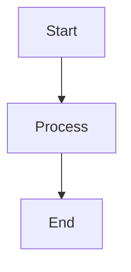

# ApraNova Documentation Setup Guide

Complete guide to setting up and deploying the ApraNova documentation on GitHub Pages.

---

## 📚 What's Included

The documentation system includes:

### Documentation Pages
- ✅ **index.md** - Home page with system overview
- ✅ **architecture.md** - Complete system architecture with diagrams
- ✅ **auth-flow.md** - Authentication and authorization flows
- ✅ **workspace-flow.md** - Docker workspace provisioning
- ✅ **api-documentation.md** - Complete REST API reference
- ✅ **database-schema.md** - Database design and relationships
- ✅ **payment-flow.md** - Stripe payment integration

### Configuration Files
- ✅ **_config.yml** - Jekyll configuration
- ✅ **Gemfile** - Ruby dependencies
- ✅ **_layouts/default.html** - Custom page layout
- ✅ **assets/css/custom.css** - Custom styling

### Automation
- ✅ **.github/workflows/deploy-docs.yml** - Auto-deployment workflow

---

## 🚀 Quick Setup (GitHub Pages)

### Step 1: Enable GitHub Pages

1. Go to your repository on GitHub
2. Click **Settings** → **Pages**
3. Under **Source**, select:
   - Branch: `main`
   - Folder: `/docs`
4. Click **Save**

### Step 2: Push Documentation

```bash
# Add all documentation files
git add docs/
git add .github/workflows/deploy-docs.yml
git add DOCUMENTATION_SETUP.md

# Commit
git commit -m "Add comprehensive documentation with GitHub Pages"

# Push to main branch
git push origin main
```

### Step 3: Wait for Deployment

- GitHub Actions will automatically build and deploy
- Check **Actions** tab for deployment status
- Documentation will be available at: `https://your-org.github.io/apranova/`

---

## 🖥️ Local Development Setup

### Prerequisites

- **Ruby**: 2.7 or higher
- **Bundler**: Ruby package manager
- **Git**: Version control

### Installation

#### Windows

```powershell
# Install Ruby (using RubyInstaller)
# Download from: https://rubyinstaller.org/

# Install Bundler
gem install bundler

# Navigate to docs directory
cd docs

# Install dependencies
bundle install

# Serve documentation
bundle exec jekyll serve

# Open browser to http://localhost:4000
```

#### Linux/Mac

```bash
# Install Ruby (Ubuntu/Debian)
sudo apt-get update
sudo apt-get install ruby-full build-essential zlib1g-dev

# Install Bundler
gem install bundler

# Navigate to docs directory
cd docs

# Install dependencies
bundle install

# Serve documentation
bundle exec jekyll serve

# Open browser to http://localhost:4000
```

---

## 📝 Adding New Documentation

### Create a New Page

1. Create a new `.md` file in `docs/` directory:

```bash
touch docs/new-page.md
```

2. Add front matter:

```yaml
---
layout: default
title: Your Page Title
---

# Your Page Title

Your content here...
```

3. Add to navigation in `docs/_config.yml`:

```yaml
navigation:
  - title: New Page
    url: /new-page
```

### Add Mermaid Diagrams

Use Mermaid for flowcharts, sequence diagrams, etc.:

````markdown

````

Supported diagram types:
- Flowcharts (`graph TB`, `graph LR`)
- Sequence diagrams (`sequenceDiagram`)
- Class diagrams (`classDiagram`)
- State diagrams (`stateDiagram-v2`)
- Entity relationship (`erDiagram`)

### Add Code Examples

Use syntax highlighting:

````markdown
```python
def hello_world():
    print("Hello, World!")
```

```javascript
const greeting = () => {
  console.log("Hello, World!");
};
```
````

---

## 🎨 Customization

### Change Theme Colors

Edit `docs/assets/css/custom.css`:

```css
:root {
    --primary-color: #61dafb;      /* Change primary color */
    --secondary-color: #092e20;    /* Change secondary color */
    --tertiary-color: #336791;     /* Change tertiary color */
}
```

### Modify Layout

Edit `docs/_layouts/default.html` to change:
- Header structure
- Navigation menu
- Footer content
- Page layout

### Update Site Configuration

Edit `docs/_config.yml`:

```yaml
title: Your Site Title
description: Your site description
github_username: your-username
repository: your-org/your-repo
```

---

## 🔧 Troubleshooting

### Issue: Documentation Not Deploying

**Solution:**
1. Check GitHub Actions tab for errors
2. Verify GitHub Pages is enabled in Settings
3. Ensure `main` branch and `/docs` folder are selected
4. Check `_config.yml` for syntax errors

### Issue: Mermaid Diagrams Not Rendering

**Solution:**
1. Verify syntax at https://mermaid.live
2. Check browser console for JavaScript errors
3. Ensure code block uses ` ```mermaid ` (not ` ```mmd `)

### Issue: Jekyll Build Fails Locally

**Solution:**
```bash
# Clear cache
bundle exec jekyll clean

# Update dependencies
bundle update

# Rebuild
bundle exec jekyll build
```

### Issue: Styles Not Applying

**Solution:**
1. Clear browser cache (Ctrl+Shift+R)
2. Check `custom.css` path in `default.html`
3. Verify CSS syntax
4. Check browser developer tools for 404 errors

---

## 📊 Documentation Structure

```
docs/
├── index.md                      # Home page
├── architecture.md               # System architecture
├── auth-flow.md                 # Authentication flow
├── workspace-flow.md            # Workspace provisioning
├── api-documentation.md         # API reference
├── database-schema.md           # Database schema
├── payment-flow.md              # Payment processing
├── README.md                    # Docs README
├── _config.yml                  # Jekyll config
├── Gemfile                      # Ruby dependencies
├── _layouts/
│   └── default.html            # Page layout
└── assets/
    └── css/
        └── custom.css          # Custom styles
```

---

## 🌐 Deployment Options

### Option 1: GitHub Pages (Recommended)

- **Pros**: Free, automatic deployment, custom domain support
- **Cons**: Public repositories only (unless GitHub Pro)
- **Setup**: Enable in repository settings

### Option 2: Netlify

```bash
# Install Netlify CLI
npm install -g netlify-cli

# Deploy
cd docs
netlify deploy --prod
```

### Option 3: Vercel

```bash
# Install Vercel CLI
npm install -g vercel

# Deploy
cd docs
vercel --prod
```

### Option 4: Self-Hosted

```bash
# Build static site
cd docs
bundle exec jekyll build

# Serve with nginx/apache
# Copy _site/ directory to web server
```

---

## 📈 Best Practices

### Documentation Writing

1. **Be Clear and Concise**: Use simple language
2. **Include Examples**: Show code examples
3. **Add Diagrams**: Visual aids help understanding
4. **Link Related Docs**: Cross-reference related pages
5. **Keep Updated**: Update docs with code changes

### Diagram Guidelines

1. **Keep Simple**: One concept per diagram
2. **Use Consistent Colors**: Match brand colors
3. **Add Labels**: Clear node and edge labels
4. **Include Legends**: Explain symbols and colors

### Code Examples

1. **Syntax Highlighting**: Use language-specific blocks
2. **Add Comments**: Explain complex code
3. **Show Input/Output**: Include request and response
4. **Multiple Languages**: Provide examples in different languages

---

## 🔗 Useful Resources

- [Jekyll Documentation](https://jekyllrb.com/docs/)
- [GitHub Pages Guide](https://docs.github.com/en/pages)
- [Mermaid Documentation](https://mermaid.js.org/)
- [Markdown Guide](https://www.markdownguide.org/)
- [Jekyll Themes](https://jekyllrb.com/docs/themes/)

---

## ✅ Checklist

Before deploying documentation:

- [ ] All pages have front matter
- [ ] Navigation menu is updated
- [ ] Mermaid diagrams render correctly
- [ ] Code examples are tested
- [ ] Links are working
- [ ] Images are optimized
- [ ] Mobile responsive
- [ ] SEO metadata added
- [ ] GitHub Pages enabled
- [ ] Custom domain configured (optional)

---

## 📞 Support

Need help with documentation?

- **GitHub Issues**: Report bugs or request features
- **Discussions**: Ask questions in GitHub Discussions
- **Email**: support@apranova.com

---

## 📄 License

Documentation is part of the ApraNova project and is licensed under the MIT License.

---

**Happy Documenting! 📚**

