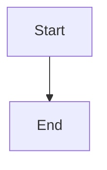
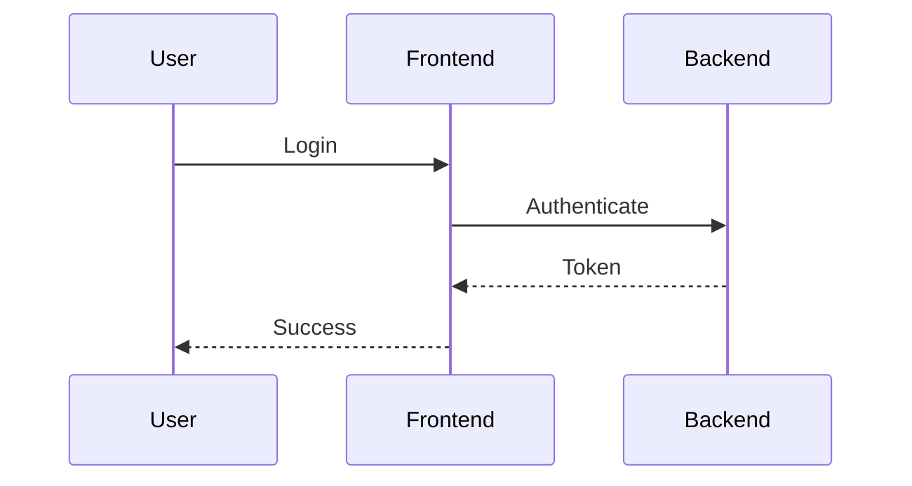

# ApraNova Documentation

This directory contains the complete system documentation for ApraNova Learning Management System, hosted on GitHub Pages.

## 📚 Documentation Structure

```
docs/
├── index.md                    # Home page
├── architecture.md             # System architecture
├── auth-flow.md               # Authentication flow
├── workspace-flow.md          # Workspace provisioning
├── api-documentation.md       # API reference
├── database-schema.md         # Database design
├── _config.yml                # Jekyll configuration
├── _layouts/                  # Custom layouts
│   └── default.html          # Default page layout
└── assets/                    # Static assets
    └── css/
        └── custom.css        # Custom styles
```

## 🚀 Viewing Documentation Locally

### Prerequisites

- Ruby 2.7 or higher
- Bundler

### Setup

1. Install Jekyll and dependencies:

```bash
cd docs
gem install bundler jekyll
bundle install
```

2. Serve the documentation locally:

```bash
bundle exec jekyll serve
```

3. Open your browser to `http://localhost:4000`

## 🌐 GitHub Pages Deployment

### Automatic Deployment

The documentation is automatically deployed to GitHub Pages when changes are pushed to the `main` branch.

### Manual Deployment

1. Ensure GitHub Pages is enabled in repository settings
2. Set source to `main` branch, `/docs` folder
3. Push changes to the `main` branch
4. Documentation will be available at: `https://your-org.github.io/apranova/`

## 📝 Adding New Documentation

### Create a New Page

1. Create a new `.md` file in the `docs/` directory
2. Add front matter at the top:

```yaml
---
layout: default
title: Your Page Title
---
```

3. Write your content using Markdown
4. Add Mermaid diagrams using code blocks:

````markdown

````

5. Add the page to navigation in `_config.yml`

### Markdown Features

- **Headers**: `# H1`, `## H2`, `### H3`
- **Bold**: `**bold text**`
- **Italic**: `*italic text*`
- **Code**: `` `inline code` ``
- **Code Blocks**: ` ```language ... ``` `
- **Links**: `[text](url)`
- **Images**: ``
- **Tables**: Use standard Markdown tables
- **Lists**: Use `-` or `1.` for lists

### Mermaid Diagrams

Supported diagram types:
- Flowcharts
- Sequence diagrams
- Class diagrams
- State diagrams
- Entity relationship diagrams
- Gantt charts

Example:

````markdown

````

## 🎨 Customization

### Styling

Edit `assets/css/custom.css` to customize:
- Colors
- Fonts
- Layout
- Components

### Layout

Edit `_layouts/default.html` to modify:
- Header
- Navigation
- Footer
- Page structure

### Configuration

Edit `_config.yml` to change:
- Site title and description
- Theme
- Navigation menu
- Plugins
- SEO settings

## 🔧 Troubleshooting

### Jekyll Build Errors

```bash
# Clear cache
bundle exec jekyll clean

# Rebuild
bundle exec jekyll build
```

### Mermaid Diagrams Not Rendering

- Check syntax in Mermaid Live Editor: https://mermaid.live
- Ensure code block uses ` ```mermaid ` (not ` ```mmd `)
- Verify JavaScript is enabled in browser

### Styles Not Applying

- Clear browser cache
- Check `custom.css` path in `default.html`
- Verify CSS syntax

## 📖 Documentation Guidelines

### Writing Style

- Use clear, concise language
- Include code examples
- Add diagrams for complex concepts
- Use tables for structured data
- Include links to related documentation

### Code Examples

- Use syntax highlighting
- Include comments
- Show both request and response
- Provide multiple language examples when applicable

### Diagrams

- Keep diagrams simple and focused
- Use consistent colors and styles
- Add legends when necessary
- Include diagram descriptions

## 🔗 Useful Links

- [Jekyll Documentation](https://jekyllrb.com/docs/)
- [GitHub Pages Documentation](https://docs.github.com/en/pages)
- [Mermaid Documentation](https://mermaid.js.org/)
- [Markdown Guide](https://www.markdownguide.org/)

## 📄 License

This documentation is part of the ApraNova project and is licensed under the MIT License.

---

**Need Help?** Open an issue on GitHub or contact the documentation team.

