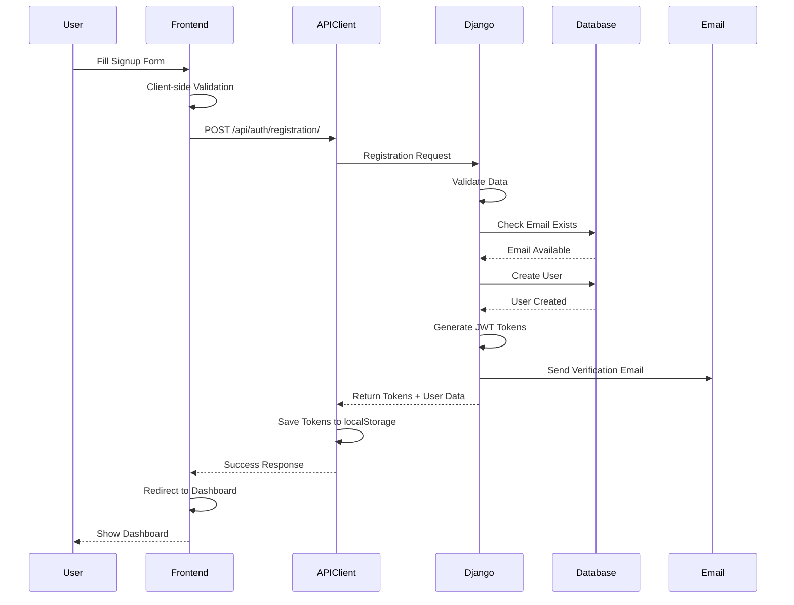
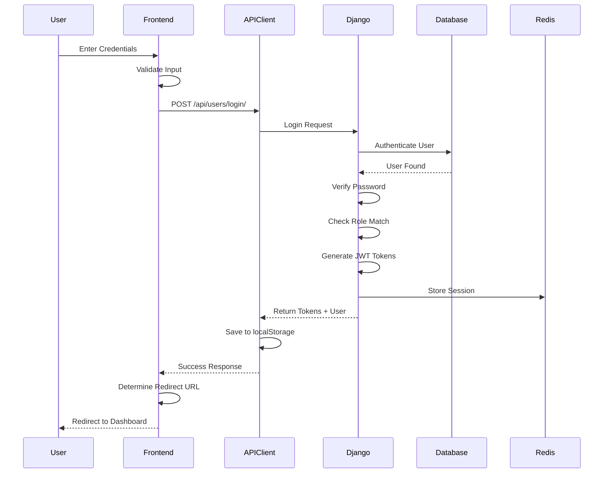
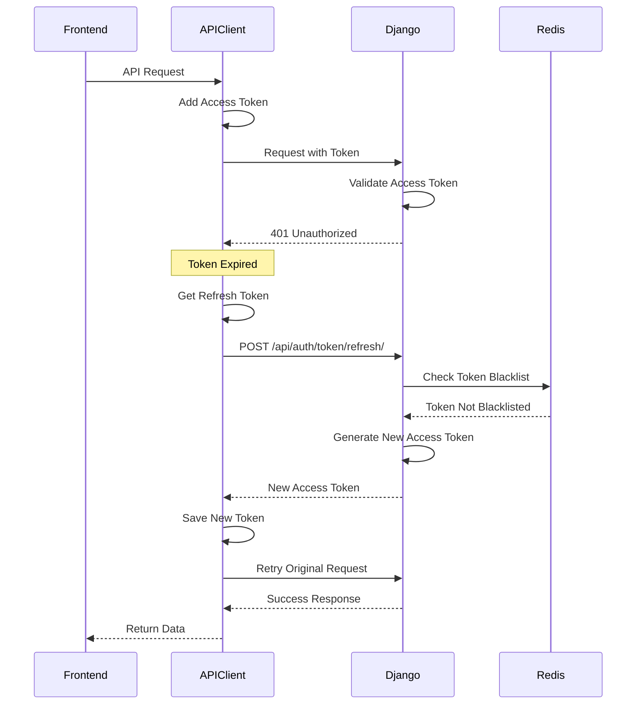
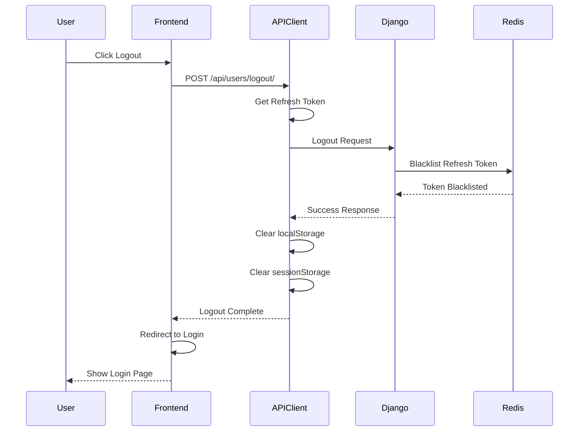
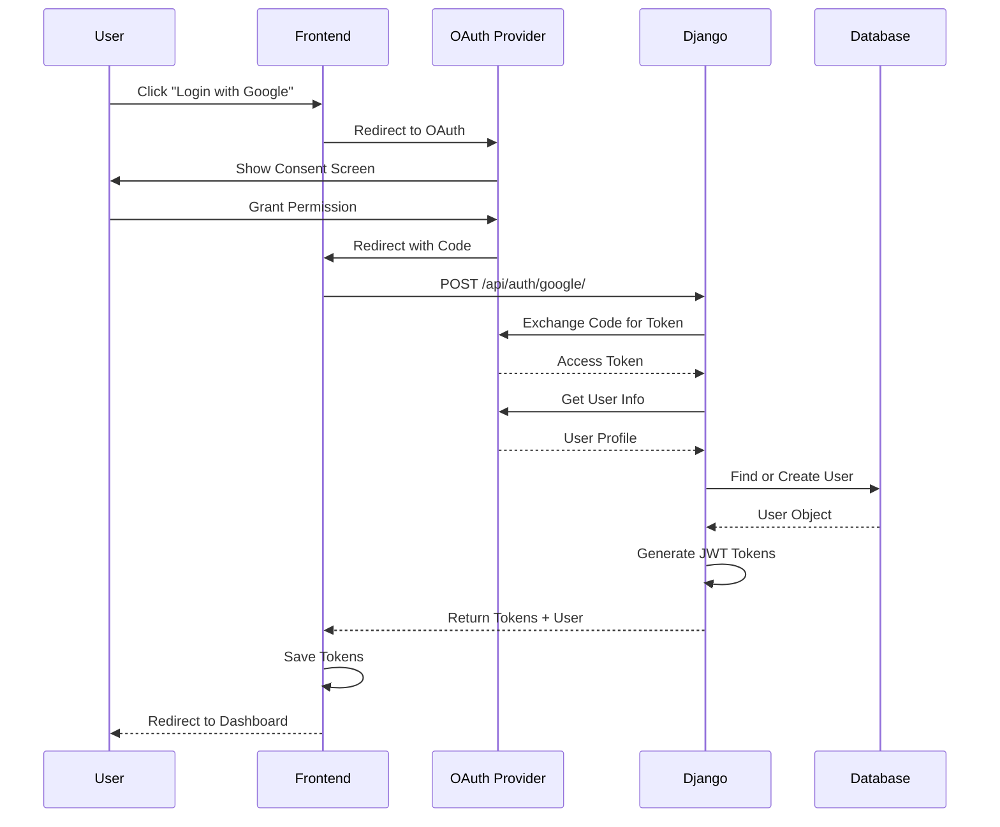
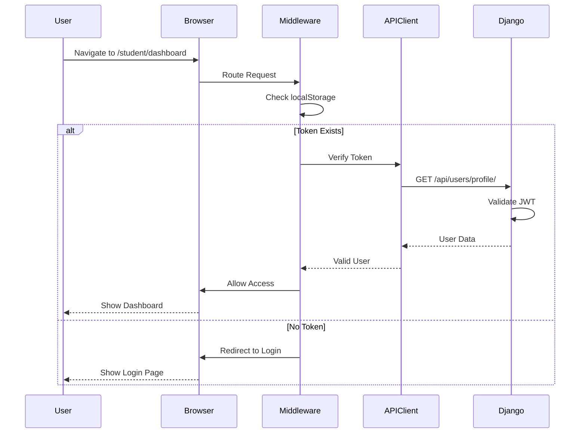
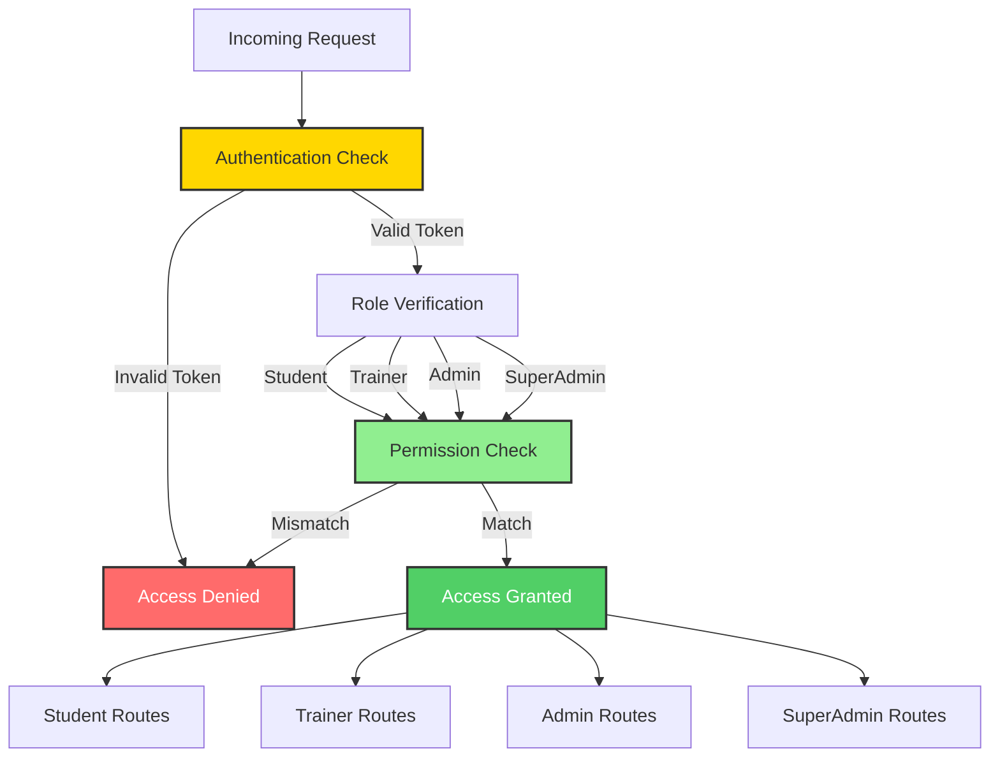
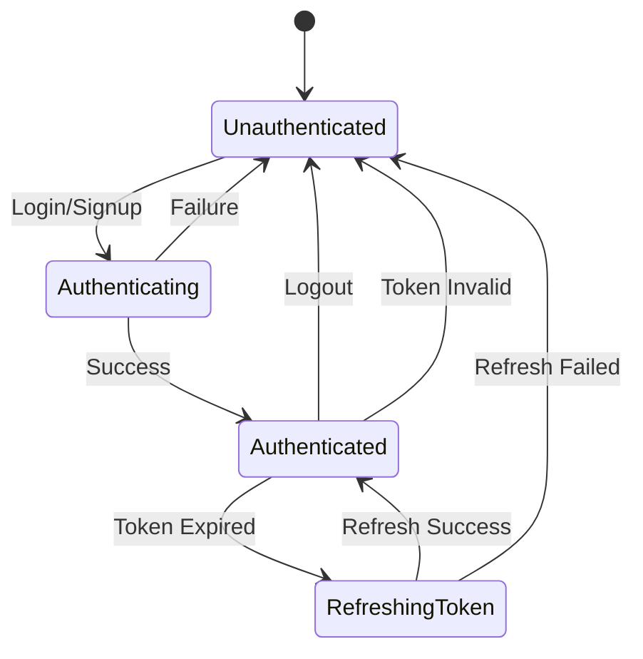

# Authentication Flow

Complete authentication and authorization flow diagrams for ApraNova LMS.

---

## 🔐 Authentication Overview

ApraNova supports multiple authentication methods:
- **Email/Password**: Traditional credentials-based authentication
- **Google OAuth**: Social authentication via Google
- **GitHub OAuth**: Social authentication via GitHub
- **JWT Tokens**: Stateless authentication with access and refresh tokens

---

## 📝 User Registration Flow



### Registration Request

**Endpoint**: `POST /api/auth/registration/`

**Request Body**:
```json
{
  "name": "John Doe",
  "email": "john@example.com",
  "password1": "SecurePass123!",
  "password2": "SecurePass123!",
  "role": "student",
  "track": "DP"
}
```

**Response**:
```json
{
  "access": "eyJ0eXAiOiJKV1QiLCJhbGc...",
  "refresh": "eyJ0eXAiOiJKV1QiLCJhbGc...",
  "user": {
    "id": 1,
    "email": "john@example.com",
    "name": "John Doe",
    "role": "student",
    "track": "DP"
  }
}
```

---

## 🔑 Login Flow



### Login Request

**Endpoint**: `POST /api/users/login/`

**Request Body**:
```json
{
  "email": "john@example.com",
  "password": "SecurePass123!",
  "role": "student"
}
```

**Response**:
```json
{
  "access": "eyJ0eXAiOiJKV1QiLCJhbGc...",
  "refresh": "eyJ0eXAiOiJKV1QiLCJhbGc...",
  "user": {
    "id": 1,
    "email": "john@example.com",
    "name": "John Doe",
    "role": "student"
  },
  "redirect_url": "/student/dashboard"
}
```

---

## 🔄 Token Refresh Flow



### Token Refresh Request

**Endpoint**: `POST /api/auth/token/refresh/`

**Request Body**:
```json
{
  "refresh": "eyJ0eXAiOiJKV1QiLCJhbGc..."
}
```

**Response**:
```json
{
  "access": "eyJ0eXAiOiJKV1QiLCJhbGc...",
  "refresh": "eyJ0eXAiOiJKV1QiLCJhbGc..."
}
```

---

## 🚪 Logout Flow



---

## 🌐 OAuth Flow (Google/GitHub)



### OAuth Login Request

**Endpoint**: `POST /api/auth/google/` or `POST /api/auth/github/`

**Request Body**:
```json
{
  "code": "4/0AY0e-g7...",
  "redirect_uri": "http://localhost:3000/auth/callback"
}
```

**Response**:
```json
{
  "access": "eyJ0eXAiOiJKV1QiLCJhbGc...",
  "refresh": "eyJ0eXAiOiJKV1QiLCJhbGc...",
  "user": {
    "id": 1,
    "email": "john@gmail.com",
    "name": "John Doe",
    "role": "student"
  }
}
```

---

## 🛡️ Protected Route Access



---

## 🔐 Role-Based Access Control



### Role Hierarchy

| Role | Access Level | Permissions |
|------|-------------|-------------|
| **Student** | Basic | Own dashboard, workspace, submissions |
| **Trainer** | Elevated | Student management, grading, batch access |
| **Admin** | High | User management, system config, reports |
| **SuperAdmin** | Full | All permissions, can access any role |

---

## 🔒 Security Measures

### Token Security

1. **Access Token**: Short-lived (15 minutes)
2. **Refresh Token**: Long-lived (7 days)
3. **Token Blacklisting**: Logout invalidates tokens
4. **HTTPS Only**: Tokens transmitted over secure connection
5. **HttpOnly Cookies**: Optional cookie-based storage

### Password Security

1. **Hashing**: bcrypt with salt
2. **Minimum Length**: 8 characters
3. **Complexity**: Uppercase, lowercase, numbers, symbols
4. **Reset Flow**: Email-based password reset
5. **Rate Limiting**: Prevent brute force attacks

---

## 📊 Authentication State Management



---

## 🔗 Related Documentation

- [API Documentation](./api-documentation.md)
- [Database Schema](./database-schema.md)
- [System Architecture](./architecture.md)

---

[← Back to Index](./index.md)

