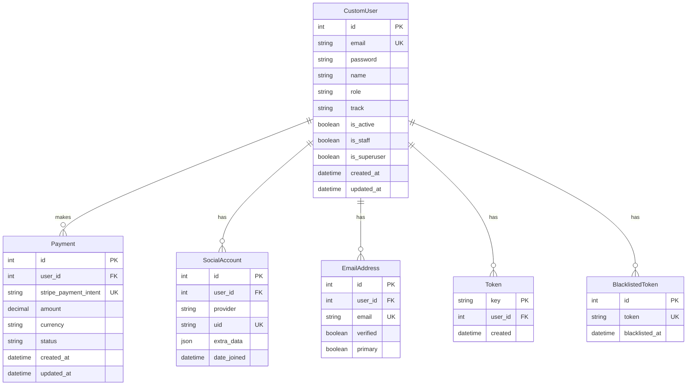
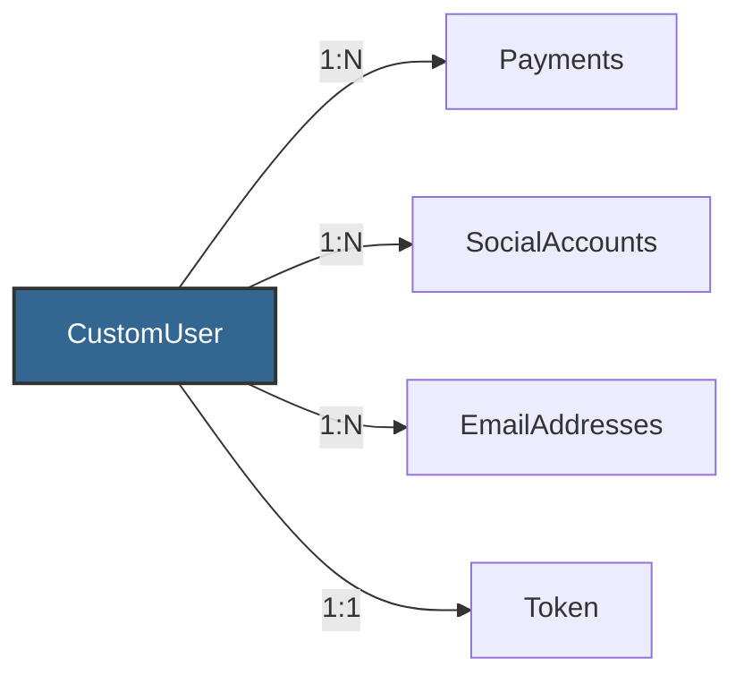
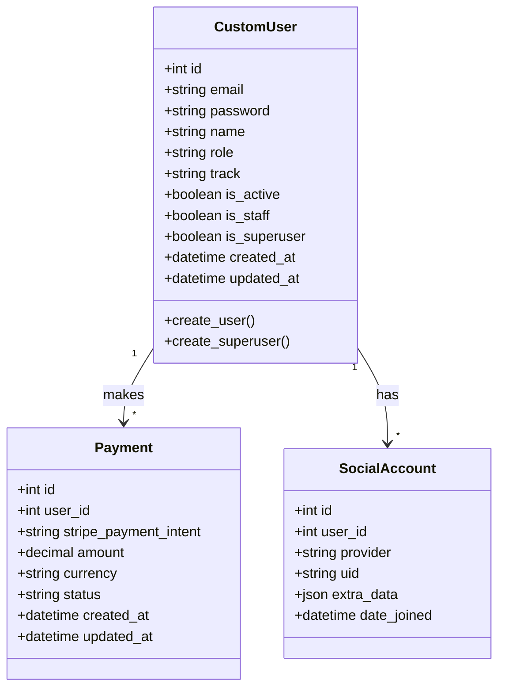

# Database Schema

Complete database design and entity relationships for ApraNova LMS.

---

## 🗄️ Database Overview

- **Database**: PostgreSQL 14
- **ORM**: Django ORM
- **Migrations**: Django Migrations
- **Connection Pooling**: Enabled
- **Timezone**: UTC

---

## 📊 Entity Relationship Diagram



---

## 📋 Table Definitions

### CustomUser Table

Primary user table with authentication and profile information.

| Column | Type | Constraints | Description |
|--------|------|-------------|-------------|
| `id` | INTEGER | PRIMARY KEY, AUTO INCREMENT | Unique user identifier |
| `email` | VARCHAR(254) | UNIQUE, NOT NULL | User email (used as username) |
| `password` | VARCHAR(128) | NOT NULL | Hashed password (bcrypt) |
| `name` | VARCHAR(255) | NOT NULL | Full name |
| `role` | VARCHAR(20) | NOT NULL | User role (student/trainer/admin/superadmin) |
| `track` | VARCHAR(10) | NULLABLE | Learning track (DP/FSD) |
| `is_active` | BOOLEAN | DEFAULT TRUE | Account active status |
| `is_staff` | BOOLEAN | DEFAULT FALSE | Staff access flag |
| `is_superuser` | BOOLEAN | DEFAULT FALSE | Superuser access flag |
| `created_at` | TIMESTAMP | DEFAULT NOW() | Account creation timestamp |
| `updated_at` | TIMESTAMP | AUTO UPDATE | Last update timestamp |

**Indexes**:
- `idx_user_email` on `email`
- `idx_user_role` on `role`
- `idx_user_active` on `is_active`

**Constraints**:
- `email` must be valid email format
- `role` must be in ('student', 'trainer', 'admin', 'superadmin')
- `track` must be in ('DP', 'FSD') or NULL

---

### Payment Table

Stores payment transaction records.

| Column | Type | Constraints | Description |
|--------|------|-------------|-------------|
| `id` | INTEGER | PRIMARY KEY, AUTO INCREMENT | Payment record ID |
| `user_id` | INTEGER | FOREIGN KEY, NOT NULL | Reference to CustomUser |
| `stripe_payment_intent` | VARCHAR(255) | UNIQUE, NOT NULL | Stripe payment intent ID |
| `amount` | DECIMAL(10,2) | NOT NULL | Payment amount |
| `currency` | VARCHAR(3) | NOT NULL | Currency code (USD, INR, etc.) |
| `status` | VARCHAR(50) | NOT NULL | Payment status |
| `created_at` | TIMESTAMP | DEFAULT NOW() | Payment creation time |
| `updated_at` | TIMESTAMP | AUTO UPDATE | Last update time |

**Indexes**:
- `idx_payment_user` on `user_id`
- `idx_payment_status` on `status`
- `idx_payment_created` on `created_at`

**Foreign Keys**:
- `user_id` REFERENCES `CustomUser(id)` ON DELETE CASCADE

---

### SocialAccount Table

OAuth social account connections.

| Column | Type | Constraints | Description |
|--------|------|-------------|-------------|
| `id` | INTEGER | PRIMARY KEY, AUTO INCREMENT | Social account ID |
| `user_id` | INTEGER | FOREIGN KEY, NOT NULL | Reference to CustomUser |
| `provider` | VARCHAR(30) | NOT NULL | OAuth provider (google/github) |
| `uid` | VARCHAR(255) | UNIQUE, NOT NULL | Provider user ID |
| `extra_data` | JSONB | NOT NULL | Additional OAuth data |
| `date_joined` | TIMESTAMP | DEFAULT NOW() | Connection date |

**Indexes**:
- `idx_social_user` on `user_id`
- `idx_social_provider` on `provider`
- `idx_social_uid` on `uid`

**Foreign Keys**:
- `user_id` REFERENCES `CustomUser(id)` ON DELETE CASCADE

---

### EmailAddress Table

Email verification and management.

| Column | Type | Constraints | Description |
|--------|------|-------------|-------------|
| `id` | INTEGER | PRIMARY KEY, AUTO INCREMENT | Email record ID |
| `user_id` | INTEGER | FOREIGN KEY, NOT NULL | Reference to CustomUser |
| `email` | VARCHAR(254) | UNIQUE, NOT NULL | Email address |
| `verified` | BOOLEAN | DEFAULT FALSE | Verification status |
| `primary` | BOOLEAN | DEFAULT FALSE | Primary email flag |

**Indexes**:
- `idx_email_user` on `user_id`
- `idx_email_verified` on `verified`

**Foreign Keys**:
- `user_id` REFERENCES `CustomUser(id)` ON DELETE CASCADE

---

### Token Table

API authentication tokens.

| Column | Type | Constraints | Description |
|--------|------|-------------|-------------|
| `key` | VARCHAR(40) | PRIMARY KEY | Token key |
| `user_id` | INTEGER | FOREIGN KEY, UNIQUE, NOT NULL | Reference to CustomUser |
| `created` | TIMESTAMP | DEFAULT NOW() | Token creation time |

**Indexes**:
- `idx_token_user` on `user_id`

**Foreign Keys**:
- `user_id` REFERENCES `CustomUser(id)` ON DELETE CASCADE

---

### BlacklistedToken Table

Blacklisted JWT refresh tokens.

| Column | Type | Constraints | Description |
|--------|------|-------------|-------------|
| `id` | INTEGER | PRIMARY KEY, AUTO INCREMENT | Blacklist record ID |
| `token` | TEXT | UNIQUE, NOT NULL | Blacklisted token |
| `blacklisted_at` | TIMESTAMP | DEFAULT NOW() | Blacklist timestamp |

**Indexes**:
- `idx_blacklist_token` on `token`
- `idx_blacklist_date` on `blacklisted_at`

---

## 🔗 Relationships

### One-to-Many Relationships



---

## 📈 Database Statistics

### Table Sizes (Estimated)

| Table | Estimated Rows | Storage Size |
|-------|---------------|--------------|
| CustomUser | 10,000 | ~2 MB |
| Payment | 50,000 | ~10 MB |
| SocialAccount | 5,000 | ~1 MB |
| EmailAddress | 10,000 | ~1 MB |
| Token | 10,000 | ~500 KB |
| BlacklistedToken | 100,000 | ~20 MB |

---

## 🔍 Common Queries

### Get User with Payments

```sql
SELECT 
    u.id,
    u.email,
    u.name,
    u.role,
    COUNT(p.id) as payment_count,
    SUM(p.amount) as total_spent
FROM accounts_customuser u
LEFT JOIN payments_payment p ON u.id = p.user_id
WHERE u.is_active = TRUE
GROUP BY u.id, u.email, u.name, u.role;
```

### Get Active Students

```sql
SELECT 
    id,
    email,
    name,
    track,
    created_at
FROM accounts_customuser
WHERE role = 'student'
  AND is_active = TRUE
ORDER BY created_at DESC;
```

### Get OAuth Users

```sql
SELECT 
    u.id,
    u.email,
    u.name,
    sa.provider,
    sa.date_joined
FROM accounts_customuser u
INNER JOIN socialaccount_socialaccount sa ON u.id = sa.user_id
WHERE sa.provider IN ('google', 'github');
```

---

## 🔐 Security Considerations

### Password Storage

- **Algorithm**: bcrypt
- **Salt**: Automatically generated per password
- **Rounds**: 12 (configurable)
- **Never stored in plain text**

### Token Security

- **JWT Access Token**: 15 minutes expiry
- **JWT Refresh Token**: 7 days expiry
- **Blacklisting**: Logout invalidates refresh tokens
- **Rotation**: New refresh token on each refresh

### Data Encryption

- **In Transit**: TLS/SSL encryption
- **At Rest**: PostgreSQL encryption (optional)
- **Sensitive Fields**: Password, tokens encrypted

---

## 🔄 Migrations

### Migration Files

```
accounts/migrations/
├── 0001_initial.py                    # Initial user model
├── 0002_alter_customuser_managers.py  # Custom user manager
├── 0003_alter_customuser_role.py      # Role field update
└── ...
```

### Running Migrations

```bash
# Create migrations
docker exec apranova_backend python manage.py makemigrations

# Apply migrations
docker exec apranova_backend python manage.py migrate

# Show migration status
docker exec apranova_backend python manage.py showmigrations
```

---

## 📊 Database Diagram (Detailed)



---

## 🔗 Related Documentation

- [System Architecture](./architecture.md)
- [API Documentation](./api-documentation.md)
- [Authentication Flow](./auth-flow.md)

---

[← Back to Index](./index.md)

