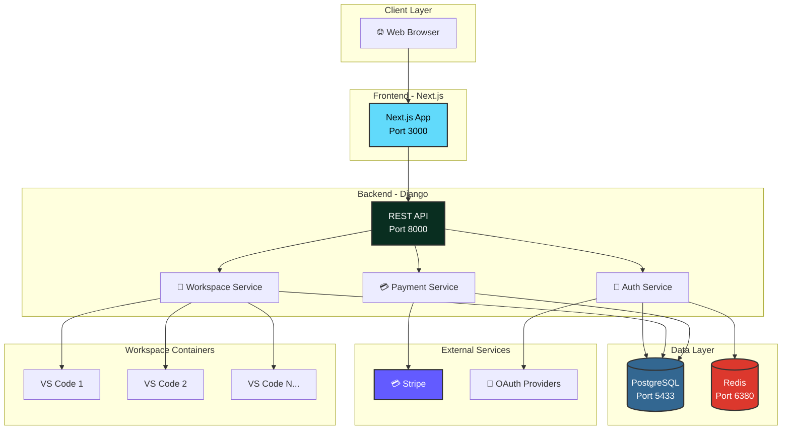

<div style="text-align: center; padding: 40px 0 20px 0;">
  <h1 style="font-size: 3em; margin-bottom: 10px; color: #2c3e50;">🎓 ApraNova LMS</h1>
  <h2 style="font-size: 1.5em; color: #7f8c8d; font-weight: 300;">Modern Learning Management System</h2>
  <p style="font-size: 1.1em; color: #95a5a6; margin-top: 20px;">
    Complete Technical Documentation & System Architecture
  </p>
</div>

<div style="background: linear-gradient(135deg, #667eea 0%, #764ba2 100%); padding: 30px; border-radius: 10px; color: white; margin: 30px 0;">
  <h3 style="margin-top: 0; color: white;">🚀 What is ApraNova?</h3>
  <p style="font-size: 1.1em; line-height: 1.6;">
    ApraNova is a <strong>cloud-native Learning Management System</strong> that provides students with isolated, 
    Docker-based VS Code workspaces, integrated payment processing, and multi-role authentication. 
    Built with Django REST Framework and Next.js for maximum scalability and performance.
  </p>
</div>

---

## 📚 Documentation Navigation

<div style="display: grid; grid-template-columns: repeat(auto-fit, minmax(300px, 1fr)); gap: 20px; margin: 30px 0;">

<div style="border: 2px solid #3498db; border-radius: 8px; padding: 20px; background: #f8f9fa;">
  <h3 style="color: #3498db; margin-top: 0;">🏗️ Architecture & Design</h3>
  <ul style="list-style: none; padding-left: 0;">
    <li style="margin-bottom: 15px;">
      📐 <a href="./architecture.html"><strong>System Architecture</strong></a><br/>
      <small style="color: #7f8c8d;">Complete system overview with interactive diagrams</small>
    </li>
    <li style="margin-bottom: 15px;">
      🗄️ <a href="./database-schema.html"><strong>Database Schema</strong></a><br/>
      <small style="color: #7f8c8d;">ERD diagrams and table relationships</small>
    </li>
    <li style="margin-bottom: 15px;">
      📡 <a href="./api-documentation.html"><strong>API Documentation</strong></a><br/>
      <small style="color: #7f8c8d;">Complete REST API reference with examples</small>
    </li>
  </ul>
</div>

<div style="border: 2px solid #9b59b6; border-radius: 8px; padding: 20px; background: #f8f9fa;">
  <h3 style="color: #9b59b6; margin-top: 0;">🔄 Flow Diagrams</h3>
  <ul style="list-style: none; padding-left: 0;">
    <li style="margin-bottom: 15px;">
      🔐 <a href="./auth-flow.html"><strong>Authentication Flow</strong></a><br/>
      <small style="color: #7f8c8d;">JWT, OAuth, and social login flows</small>
    </li>
    <li style="margin-bottom: 15px;">
      🐳 <a href="./workspace-flow.html"><strong>Workspace Provisioning</strong></a><br/>
      <small style="color: #7f8c8d;">Docker-in-Docker workspace creation</small>
    </li>
    <li style="margin-bottom: 15px;">
      💳 <a href="./payment-flow.html"><strong>Payment Processing</strong></a><br/>
      <small style="color: #7f8c8d;">Stripe integration and payment flows</small>
    </li>
  </ul>
</div>

</div>

---

## 🚀 Quick Start

<div style="background: #ecf0f1; padding: 20px; border-radius: 8px; border-left: 4px solid #e74c3c; margin: 20px 0;">
  <p style="margin: 0;"><strong>📦 GitHub Repository:</strong> <a href="https://github.com/prempp/ApraNova" target="_blank">github.com/prempp/ApraNova</a></p>
  <p style="margin: 10px 0 0 0;"><strong>🔧 Tech Stack:</strong> Django 5.2.7 • Next.js 15.2.4 • PostgreSQL 14 • Redis 7 • Docker</p>
</div>

---

## 🏗️ System Overview

<table style="width: 100%; border-collapse: collapse; margin: 20px 0;">
  <tr>
    <td style="padding: 15px; border: 1px solid #ddd; background: #f8f9fa; width: 30%;"><strong>🎯 Purpose</strong></td>
    <td style="padding: 15px; border: 1px solid #ddd;">Full-featured Learning Management System with Docker-based workspaces</td>
  </tr>
  <tr>
    <td style="padding: 15px; border: 1px solid #ddd; background: #f8f9fa;"><strong>👥 User Roles</strong></td>
    <td style="padding: 15px; border: 1px solid #ddd;">Student, Trainer, Admin, SuperAdmin</td>
  </tr>
  <tr>
    <td style="padding: 15px; border: 1px solid #ddd; background: #f8f9fa;"><strong>🔐 Authentication</strong></td>
    <td style="padding: 15px; border: 1px solid #ddd;">JWT Tokens, OAuth 2.0 (Google, GitHub)</td>
  </tr>
  <tr>
    <td style="padding: 15px; border: 1px solid #ddd; background: #f8f9fa;"><strong>💻 Workspaces</strong></td>
    <td style="padding: 15px; border: 1px solid #ddd;">Isolated Docker containers with VS Code (code-server)</td>
  </tr>
  <tr>
    <td style="padding: 15px; border: 1px solid #ddd; background: #f8f9fa;"><strong>💳 Payments</strong></td>
    <td style="padding: 15px; border: 1px solid #ddd;">Stripe API integration for course payments</td>
  </tr>
  <tr>
    <td style="padding: 15px; border: 1px solid #ddd; background: #f8f9fa;"><strong>🗄️ Database</strong></td>
    <td style="padding: 15px; border: 1px solid #ddd;">PostgreSQL 14 with Redis caching</td>
  </tr>
</table>

---

## 🛠️ Technology Stack

<div style="display: grid; grid-template-columns: repeat(auto-fit, minmax(250px, 1fr)); gap: 15px; margin: 20px 0;">

<div style="background: #092e20; color: white; padding: 20px; border-radius: 8px;">
  <h4 style="margin-top: 0; color: white;">⚙️ Backend</h4>
  <ul style="margin: 0; padding-left: 20px; line-height: 1.8;">
    <li>Django 5.2.7</li>
    <li>Django REST Framework</li>
    <li>PostgreSQL 14</li>
    <li>Redis 7</li>
    <li>JWT Authentication</li>
    <li>Stripe API</li>
  </ul>
</div>

<div style="background: #61dafb; color: #000; padding: 20px; border-radius: 8px;">
  <h4 style="margin-top: 0;">⚛️ Frontend</h4>
  <ul style="margin: 0; padding-left: 20px; line-height: 1.8;">
    <li>Next.js 15.2.4</li>
    <li>React 19</li>
    <li>Tailwind CSS</li>
    <li>Axios</li>
    <li>Context API</li>
    <li>TypeScript Ready</li>
  </ul>
</div>

<div style="background: #2496ed; color: white; padding: 20px; border-radius: 8px;">
  <h4 style="margin-top: 0; color: white;">🐳 Infrastructure</h4>
  <ul style="margin: 0; padding-left: 20px; line-height: 1.8;">
    <li>Docker Compose</li>
    <li>Docker-in-Docker</li>
    <li>Nginx</li>
    <li>Gunicorn</li>
    <li>code-server</li>
    <li>GitHub Actions</li>
  </ul>
</div>

</div>

---

## 📊 High-Level Architecture



---

## ✨ Key Features

<div style="display: grid; grid-template-columns: repeat(auto-fit, minmax(280px, 1fr)); gap: 20px; margin: 20px 0;">

<div style="border-left: 4px solid #3498db; padding: 15px; background: #f8f9fa;">
  <h4 style="color: #3498db; margin-top: 0;">👨‍🎓 For Students</h4>
  <ul style="margin: 0; padding-left: 20px;">
    <li>Personal dashboard</li>
    <li>Docker-based VS Code workspace</li>
    <li>Project submissions</li>
    <li>Course enrollment & payments</li>
    <li>Progress tracking</li>
  </ul>
</div>

<div style="border-left: 4px solid #9b59b6; padding: 15px; background: #f8f9fa;">
  <h4 style="color: #9b59b6; margin-top: 0;">👨‍🏫 For Trainers</h4>
  <ul style="margin: 0; padding-left: 20px;">
    <li>Student management</li>
    <li>Assignment creation</li>
    <li>Grading system</li>
    <li>Batch management</li>
    <li>Progress analytics</li>
  </ul>
</div>

<div style="border-left: 4px solid #e74c3c; padding: 15px; background: #f8f9fa;">
  <h4 style="color: #e74c3c; margin-top: 0;">👨‍💼 For Admins</h4>
  <ul style="margin: 0; padding-left: 20px;">
    <li>User management</li>
    <li>System configuration</li>
    <li>Analytics & reporting</li>
    <li>Payment management</li>
    <li>Role-based access control</li>
  </ul>
</div>

</div>

---

## 🔐 Security Features

<div style="background: #fff3cd; border: 1px solid #ffc107; padding: 20px; border-radius: 8px; margin: 20px 0;">
  <h4 style="margin-top: 0; color: #856404;">🛡️ Built-in Security</h4>
  <div style="display: grid; grid-template-columns: repeat(auto-fit, minmax(200px, 1fr)); gap: 10px;">
    <div>✅ JWT Authentication</div>
    <div>✅ CORS Protection</div>
    <div>✅ CSRF Protection</div>
    <div>✅ Password Hashing (bcrypt)</div>
    <div>✅ Role-Based Access Control</div>
    <div>✅ Docker Isolation</div>
    <div>✅ HTTPS Ready</div>
    <div>✅ Token Blacklisting</div>
  </div>
</div>

---

## 📖 Documentation Pages

| Page | Description |
|------|-------------|
| [🏗️ Architecture](./architecture.html) | Complete system architecture with component diagrams |
| [🔐 Authentication](./auth-flow.html) | JWT, OAuth, and social login implementation |
| [🐳 Workspaces](./workspace-flow.html) | Docker-in-Docker workspace provisioning |
| [💳 Payments](./payment-flow.html) | Stripe payment integration and flows |
| [📡 API Docs](./api-documentation.html) | Complete REST API reference |
| [🗄️ Database](./database-schema.html) | Database schema and relationships |

---

## 🚦 Getting Started

```bash
# Clone the repository
git clone https://github.com/prempp/ApraNova.git
cd ApraNova

# Start all services with Docker Compose
docker-compose -f docker-compose.complete.yml up -d

# Access the application
# Frontend: http://localhost:3000
# Backend API: http://localhost:8000
# Admin Panel: http://localhost:8000/admin
```

---

<div style="text-align: center; padding: 30px 0; background: #f8f9fa; border-radius: 8px; margin: 30px 0;">
  <h3 style="color: #2c3e50;">📞 Need Help?</h3>
  <p style="color: #7f8c8d;">
    <a href="https://github.com/prempp/ApraNova/issues">Report an Issue</a> • 
    <a href="https://github.com/prempp/ApraNova">View on GitHub</a>
  </p>
  <p style="color: #95a5a6; font-size: 0.9em; margin-top: 20px;">
    Last Updated: 2025 • Version 1.0.0
  </p>
</div>

