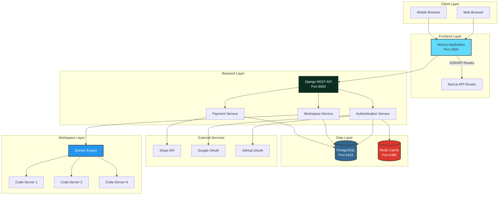

# ApraNova Learning Management System
## Complete System Documentation

Welcome to the comprehensive documentation for ApraNova LMS - a modern, Docker-based learning management system built with Django REST Framework and Next.js.

---

## 📚 Documentation Index

### Architecture & Design
- [System Architecture](./architecture.md) - Complete system overview and component interactions
- [Database Schema](./database-schema.md) - Database design and relationships
- [API Documentation](./api-documentation.md) - Complete API reference

### Flow Diagrams
- [Authentication Flow](./auth-flow.md) - User authentication and authorization
- [Workspace Provisioning](./workspace-flow.md) - Docker-based workspace creation
- [Payment Processing](./payment-flow.md) - Stripe payment integration

### Deployment & Operations
- [Deployment Guide](./deployment.md) - Production deployment instructions
- [Docker Setup](./docker-setup.md) - Container orchestration details
- [Monitoring & Logging](./monitoring.md) - System monitoring and debugging

### Development
- [Getting Started](./getting-started.md) - Quick start guide for developers
- [Contributing](./contributing.md) - Contribution guidelines
- [Testing Guide](./testing.md) - Testing strategies and examples

---

## 🚀 Quick Links

- **GitHub Repository**: [ApraNova](https://github.com/your-org/apranova)
- **Live Demo**: [demo.apranova.com](https://demo.apranova.com)
- **API Swagger**: [api.apranova.com/swagger](https://api.apranova.com/swagger)

---

## 🏗️ System Overview

ApraNova is a comprehensive Learning Management System featuring:

- **Multi-Role Authentication**: Student, Trainer, Admin, SuperAdmin
- **Docker-Based Workspaces**: Isolated VS Code environments for each student
- **Payment Integration**: Stripe payment processing
- **OAuth Support**: Google and GitHub authentication
- **Real-time Updates**: WebSocket support for live notifications
- **Scalable Architecture**: Microservices-ready design

---

## 🛠️ Technology Stack

### Backend
- **Framework**: Django 5.2.7 + Django REST Framework
- **Database**: PostgreSQL 14
- **Cache**: Redis 7
- **Authentication**: JWT + OAuth 2.0
- **Payment**: Stripe API
- **Containerization**: Docker + Docker-in-Docker

### Frontend
- **Framework**: Next.js 15.2.4 (App Router)
- **UI Library**: React 19 + Tailwind CSS
- **State Management**: React Context API
- **HTTP Client**: Axios with interceptors
- **Authentication**: JWT tokens in localStorage

### Infrastructure
- **Orchestration**: Docker Compose
- **Web Server**: Gunicorn (Backend), Node.js (Frontend)
- **Reverse Proxy**: Nginx (Production)
- **Code Server**: VS Code in browser for workspaces

---

## 📊 System Architecture Diagram

---

## 🔐 Security Features

- **JWT Authentication**: Secure token-based authentication
- **CORS Protection**: Configured allowed origins
- **CSRF Protection**: Django CSRF middleware
- **Password Hashing**: bcrypt password hashing
- **Role-Based Access Control**: Fine-grained permissions
- **Docker Isolation**: Isolated workspace environments
- **HTTPS Ready**: SSL/TLS support in production

---

## 📈 Performance Features

- **Redis Caching**: Fast data retrieval
- **Database Indexing**: Optimized queries
- **Static File Serving**: WhiteNoise for static files
- **Connection Pooling**: Database connection optimization
- **Lazy Loading**: Frontend code splitting
- **Docker Volumes**: Persistent data storage

---

## 🎯 Key Features

### For Students
- Personal dashboard with course progress
- Docker-based VS Code workspace
- Project submission system
- Real-time notifications
- Payment integration for courses

### For Trainers
- Student management dashboard
- Assignment creation and grading
- Progress tracking
- Batch management

### For Admins
- User management
- System configuration
- Analytics and reporting
- Payment management

---

## 📞 Support & Contact

- **Documentation Issues**: [GitHub Issues](https://github.com/your-org/apranova/issues)
- **Email Support**: support@apranova.com
- **Community**: [Discord Server](https://discord.gg/apranova)

---

## 📄 License

This project is licensed under the MIT License - see the [LICENSE](../LICENSE) file for details.

---

**Last Updated**: {{ site.time | date: '%B %d, %Y' }}

**Version**: 1.0.0

